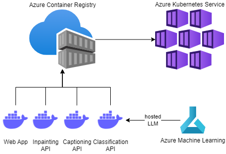

# Hateful Memes Detection application deployment on Azure

The deployment of the system is done on the Azure cloud by utilizing several Azure services to host the architecture.

## Cloud infrastructure

The concept is depicted on the diagram.



The architecture on cloud leverages several components:
* Large Language Model [vinai/bertweet-large](https://huggingface.co/vinai/bertweet-large) used for classification is hosted using Azure Machine Learning
* Each microservice is containerized and Docker images are pushed to Azure Container Registry
* Containers are managed by Azure Kubernetes Service

## Deployment

**Prerequisites**:
* Valid Azure subscription.
* Azure client installed (`az` cli).
* Docker Engine installed on your local computer. You can download and install it from [Docker website](https://docs.docker.com/engine/install/).
* Terraform installed on your machine. You can download and install it from [Terraform Downloads](https://www.terraform.io/downloads.html).
* Kubernetes client installed (`kubectl`). You can download and install it from [Kubernetes Tools](https://kubernetes.io/docs/tasks/tools/).

1. **Log in** to your Azure acount using Aure client commands:
```bash
az login
az account set --subscription "your-azure-subscription-id"
```

2. **Create resource group and container registry** using Azure client command:
```bash
az group create --name memes-resource-group --location WestEurope
az acr create --resource-group memes_rg --name memescontainerregistry --sku Basic
```

3. **Build** each Docker image and **push** the container to Azure Container Registry using Docker commands.
```bash
cd ../demo/ # navigate to each folder (captions, demo, inpainting, procap)
docker login memescontainerregistry.azurecr.io
docker build -t memescontainerregistry.azurecr.io/<docker_image_name> .
docker push memescontainerregistry.azurecr.io/<docker_image_name>
```


4. **Deploy** the infrastructure using Terraform (after providing the env variables):
```bash
cd deployment # change dir to deployment folder.
terraform init
terraform import azurerm_resource_group.memes-resource-group /subscriptions/<your-azure-subscription-id>/resourceGroups/memes-resource-group
terraform plan
terraform apply
```

5. **Deploy** the LLM model using the Azure Machine Learning Python SDK script:
```bash
pip install -r deployment/requirements.txt
python deployment/deploy_model.py
```

6. **Deploy** Docker containers to Azure Kubernetes Service using `Kubectl` client:
```bash
kubectl apply -f containers-deploy.yaml
```